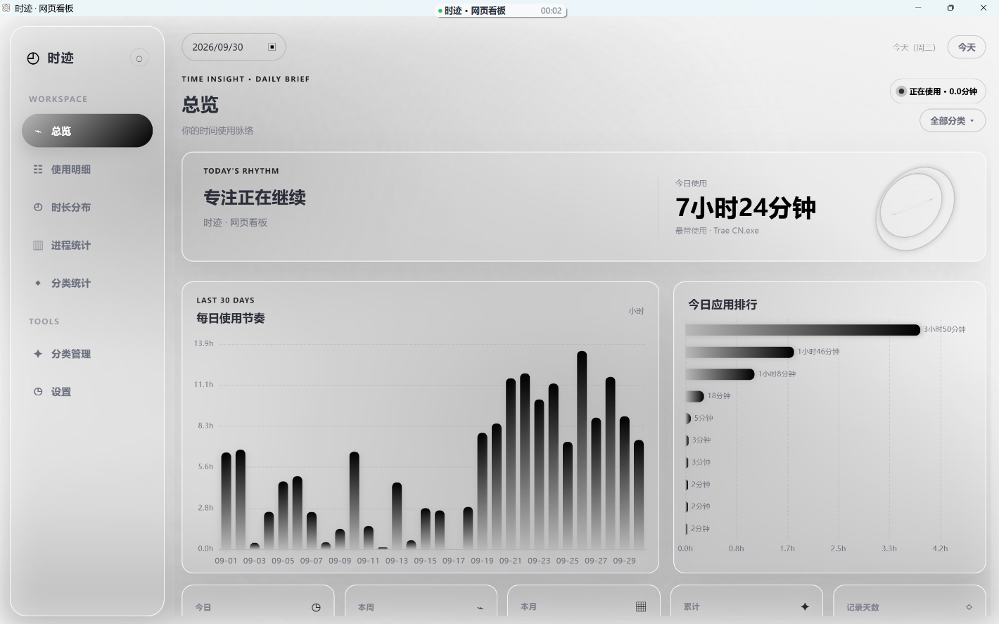
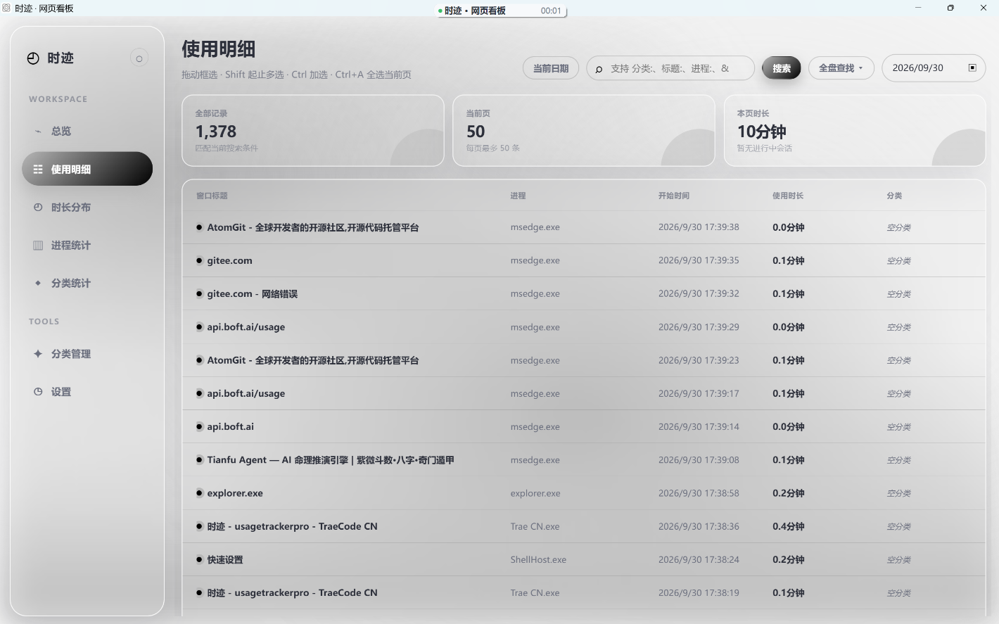
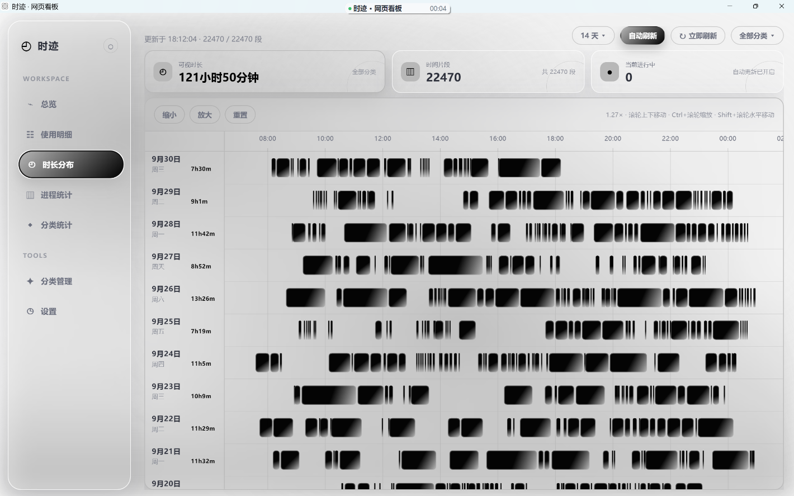
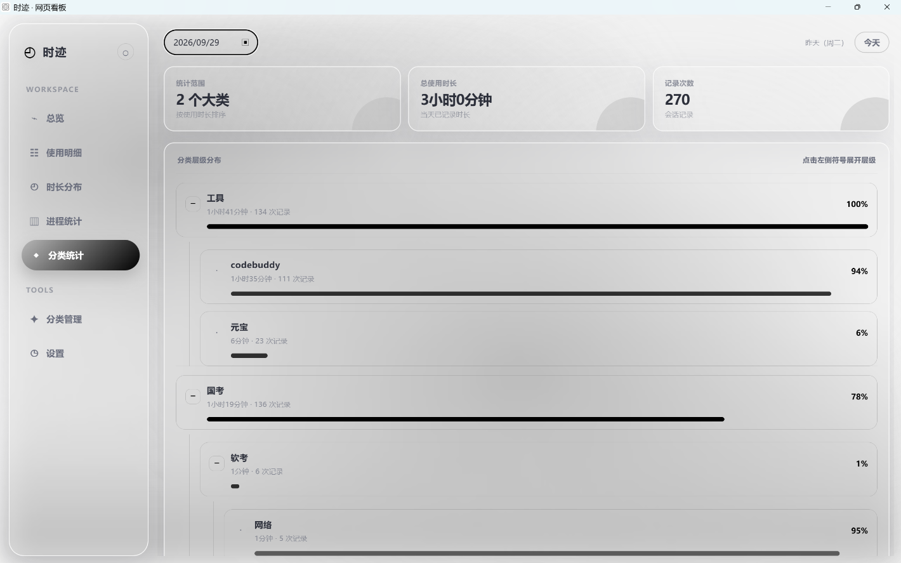
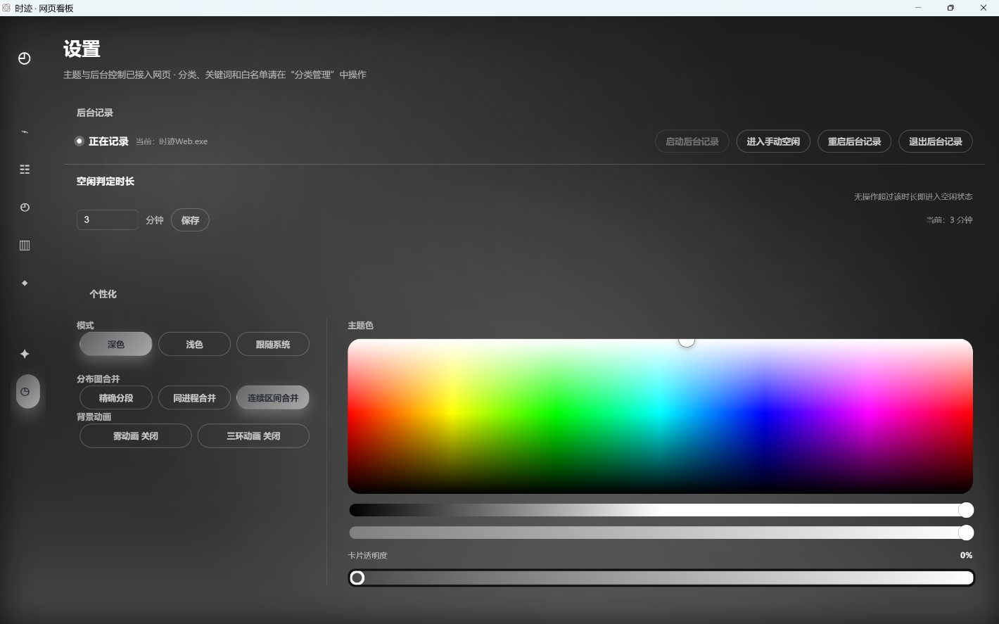

<div align="center">

# 时迹 · UsageTracker

**Windows 本地使用时长记录工具 —— 自动记录 · 智能空闲判定 · 时间脉络可视化**

[](https://github.com/Junmst/UsageTracker/releases/latest)
[](https://github.com/Junmst/UsageTracker/releases/latest)
[](https://github.com/Junmst/UsageTracker/releases/latest)
[](#-许可证)

### [⬇️ 点击下载最新版（解压即用）](https://github.com/Junmst/UsageTracker/releases/download/v4.0.0/UT-v4.0.0-win-x64.zip)



*总览 · 每日使用节奏与应用排行*

</div>

---

## ✨ 特性一览

- **自动记录** —— 后台采样前台窗口，精确到进程名与窗口标题，SQLite 本地持久化
- **智能空闲判定** —— 看视频、听音乐、阅读等无键鼠输入场景不误判：音频会话检测 + 前台视频播放识别 + 多进程映射（如腾讯视频 QQLive 及其子进程）
- **真实标题识别** —— 基于 UI Automation 读取浏览器标签页、本地 PDF 等真实标题，而不是只记一个"学习"
- **时间分布图** —— Canvas 高性能时间轴：滚轮缩放、拖动、惯性滑动，按天分行的使用脉络一览无余
- **三级分类体系** —— 大类 / 父类 / 子类 + 关键词规则 + 手动指定，自动归类每一段使用会话
- **桌面小窗** —— 呼吸灯实时呈现记录 / 空闲 / 看视频状态；吸顶吸附屏幕顶缘、拖动自动吸边、单击进入手动空闲
- **全局快捷键** —— 自定义组合键，一键手动进入 / 退出空闲
- **空闲判定自定义** —— 1–1440 分钟自由设置，本地持久化保存
- **深浅色主题** —— 深色 / 浅色 / 跟随系统 + 34 色强调色预设 + 面板透明度调节
- **数据完全本地** —— 无需联网注册；支持使用数据 / 分类配置 / 完整备份的导入导出，导入前预览与冲突统计

## 🆕 v4.0.0 新特性

- **移除启动器窗口** —— 全局快捷键与登录后启动迁入网页设置页；托盘菜单精简为「打开面板 / 小窗开关 / 退出程序」，小窗右键直接打开网页看板
- **SSE 后台数据变更自动局部刷新** —— 任意页面操作或后台自动重分类后，前端自动局部更新，无需手动刷新
- **桌面小窗交互升级** —— 支持上下左右四边 0px 间隙吸附；右键打开网页看板，单击进入手动空闲
- **虚拟桌面支持** —— 小窗与网页看板自动固定到所有 Windows 虚拟桌面，从任意桌面均可快速召唤

## 🖼️ 界面预览

| 使用明细 | 时间分布 |
| --- | --- |
|  |  |
| **分类统计** | **设置** |
|  |  |

## 📦 下载即用

1. 从 [**Releases**](https://github.com/Junmst/UsageTracker/releases/latest) 下载 `UT-v*-win-x64.zip`
2. 完整解压到任意目录（不要只复制单个 exe）
3. 双击 **`时迹Web.exe`** —— 自动启动同目录 `时迹.exe` 开始后台记录
4. 从系统托盘菜单、桌面小窗或全局快捷键打开网页看板

> 💡 无需安装 .NET 运行时，压缩包已包含全部依赖。Windows 10/11 x64。
> 数据保存在本地 `%LocalAppData%\时迹`，卸载只需删除目录。

## 🏗️ 架构

```text
┌────────────────────────────────┐       Named Pipe        ┌────────────────────────────┐
│  时迹Web.exe                    │ ◄─────────────────────► │  时迹.exe                   │
│  · 托盘 + 桌面小窗              │                         │  · 前台窗口采样             │
│  · WebView2 网页看板            │   web: 命令 / 查询       │  · UIA 真实标题读取         │
│  · ASP.NET Core Minimal API    │   native: 会话数据       │  · 空闲 / 音频 / 视频检测    │
│  · React + TypeScript + Vite   │                         │  · SQLite (WAL) 持久化      │
└────────────────────────────────┘                         └────────────────────────────┘
```

| 目录 | 说明 |
| --- | --- |
| `UsageTrackerNative/` | 无窗口后台记录代理（前台采样、UIA 标题、空闲/媒体检测、SQLite） |
| `UsageTrackerWeb/web/` | React + TypeScript + Vite 前端 |
| `UsageTrackerWeb/backend/` | ASP.NET Core Minimal API、托盘 / 小窗 / WebView2 壳 |
| `UsageTrackerNative/tests/` | 核心逻辑回归测试（日界线、跨日裁剪、表达式匹配、分类优先级） |

Web 与 Native 通过 Named Pipe 通信；Web 端以只读方式访问 SQLite（WAL 模式），读写分离互不阻塞。

## 🛠️ 从源码构建

环境要求：Windows 10/11 x64、.NET 8 SDK、Node.js 18+。

```powershell
# 1. 前端
cd UsageTrackerWeb/web
npm ci
npm run build

# 2. Web 后端（托盘 + 看板 + API）
cd ..\backend
dotnet publish -c Release -r win-x64 --self-contained true -o ..\..\publish

# 3. Native 后台记录代理（与 Web 输出到同一目录）
cd ..\..\UsageTrackerNative\src\UsageTrackerNative
dotnet publish -c Release -r win-x64 --self-contained true -o ..\..\..\publish
```

> `UsageTrackerWeb/backend/UsageTrackerWeb.csproj` 默认在 `dotnet build/publish` 前自动执行前端构建；离线或只验证后端时可加 `-p:SkipFrontendBuild=true`。
> 发布顺序必须先 Web 后端、后 Native：时迹Web 只会启动同目录的 `时迹.exe`，缺少该文件时看板无法读写数据。

## 🧪 自动化测试

```powershell
cd UsageTrackerNative\tests\UsageTrackerNative.Tests
dotnet test -c Release
```

覆盖 4:00 日界线、跨日时长裁剪、搜索表达式匹配、直属子类规则和手动分类优先级。

## 📄 许可证

本项目使用 [MIT License](UsageTrackerNative/LICENSE)。
